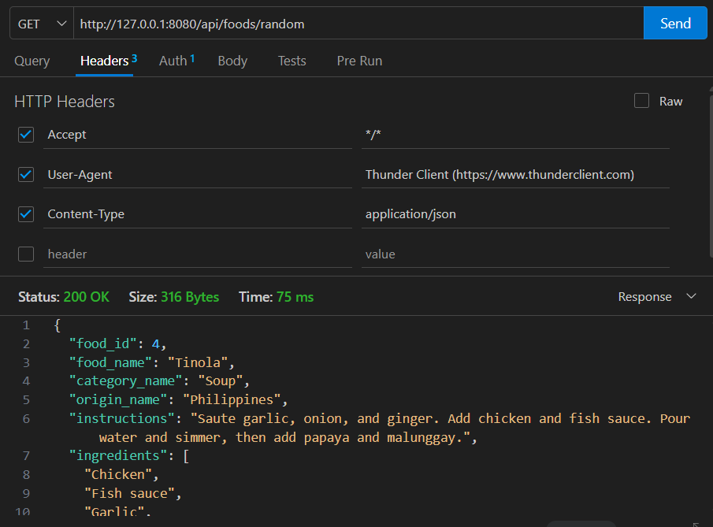
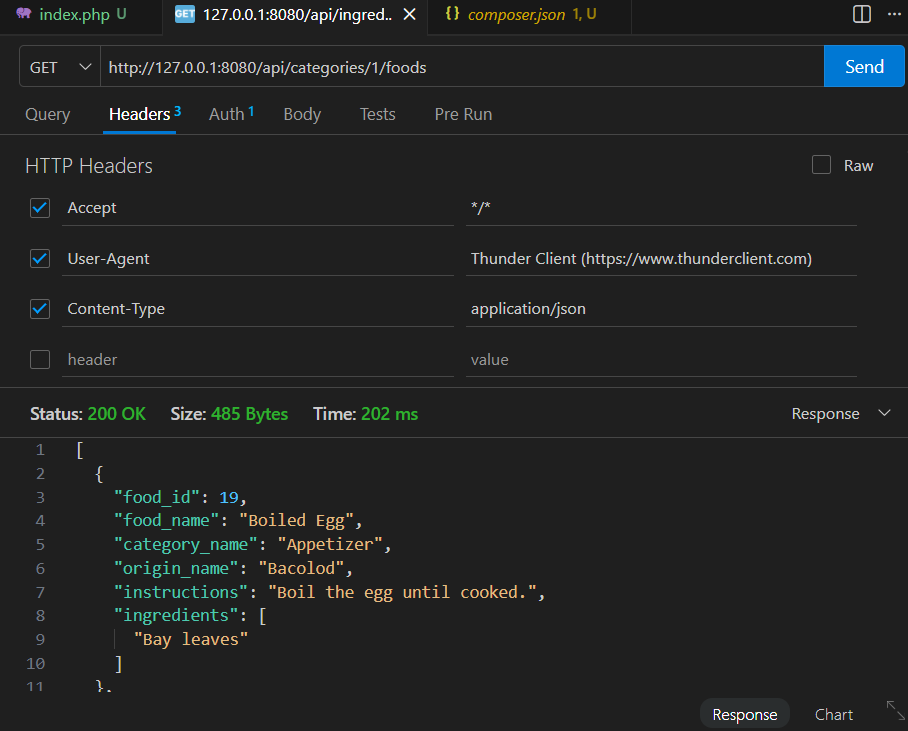

# Filipino Cookbook API

## API Title
Filipino Cookbook API

## API Description
This project is a Slim PHP REST API for managing Filipino foods, categories, origins, ingredients, and food-related records. It is designed for another student to install, configure, and consume from a driver or client application.

### Purpose of the API
- Provide Filipino food information through JSON endpoints
- Support future front-end or client applications
- Demonstrate PHP Slim REST API development with token authentication

### Type of Information Provided
- Filipino food items and instructions
- Food categories
- Ingredient lists
- Origins for foods

### Intended Users
- Students using the API for lab activities
- Front-end developers building a client application
- Anyone learning REST API integration with PHP and MySQL

### Main Functions of the API
- Retrieve all foods
- Retrieve a single food by ID
- Search foods by name
- Retrieve foods by category
- Retrieve a random food
- Retrieve all categories and ingredients
- Add a new food record
- Authenticate requests using a Bearer token

### Technologies Used
- PHP
- Slim Framework
- MySQL
- Composer
- JSON
- XAMPP or local web server
- Postman or Thunder Client
- Git and GitHub

## Features
- List all foods with ingredients and category/origin details
- Get a single food by ID with full ingredient list
- Search foods by name (case-insensitive)
- List all food categories
- List all ingredients
- Get foods by category
- Get a random food
- Add a new food record with validation
- Bearer token authentication for /api routes
- Basic rate limiting for /api requests

## Optional API Enhancements

### Enhancement Description
Two new endpoints were added to improve client workflows and make the API more useful for a future UI:
- `GET /api/foods/random`
- `GET /api/categories/{id}/foods`

A new security improvement was also added:
- Basic rate limiting for API requests

### Files Modified for Enhancements
- `public/index.php`

### Endpoints Added
- `GET /api/foods/random`
- `GET /api/categories/{id}/foods`

### Security Features Implemented
- Basic rate limiting for API requests

### Testing the Enhancements (Thunder Client)
Use Thunder Client in VS Code to create and run requests. For each request:

- Click **New Request** → set the **Method** and **URL** → open **Headers** and add the required headers → click **Send**.

- **Random food endpoint**
  - Method: `GET`
  - URL: `http://localhost:8000/api/foods/random`
  - Headers:
    - `Authorization: Bearer YOUR_API_TOKEN`
    - `Accept: application/json`
  - Expected response (HTTP 200):
    ```json
    {
      "food_id": 14,
      "food_name": "Bulalo",
      "category_name": "Soup",
      "origin_name": "Philippines",
      "instructions": "Boil beef shank and bone marrow until tender. Add corn and vegetables, then simmer before serving.",
      "ingredients": ["Beef shank","Bone marrow","Cabbage","Corn","Onion","Pechay","Peppercorn"]
    }
    ```

- **Category foods endpoint**
  - Method: `GET`
  - URL: `http://localhost:8000/api/categories/1/foods` (replace `1` with a valid category id)
  - Headers:
    - `Authorization: Bearer YOUR_API_TOKEN`
    - `Accept: application/json`
  - Expected response (HTTP 200):
    ```json
    [
      {
        "food_id": 11,
        "food_name": "Lumpiang Shanghai",
        "category_name": "Appetizer",
        "origin_name": "Philippines",
        "instructions": "Mix ground pork, vegetables, and egg. Wrap in spring roll wrappers and deep-fry until golden brown.",
        "ingredients": ["Carrots","Egg","Garlic","Ground pork","Onion","Spring roll wrapper"]
      }
    ]
    ```

- **Quick rate-limit smoke test**
  - Send several quick requests to a single endpoint (e.g., `GET /api/foods`) from Thunder Client using the same headers. If the rate limit is exceeded you should see a `429` response and a JSON error, for example:
    ```json
    {
      "status": "error",
      "message": "Too many requests. Rate limit exceeded."
    }
    ```

### Enhancement Testing Screenshots
Random food endpoint test:


Category foods endpoint test:


## Repository Contents
The repository contains:
- `public/` — API entry file and route definitions
- `composer.json` — PHP dependency definitions
- `config.example.php` — example configuration file
- `filipino_cookbook_api.sql` — SQL file for database setup
- `README.md` — full installation and API documentation
- `.gitignore` — files excluded from Git tracking
- `Screenshots/` — evidence of successful endpoint testing

## Installation Instructions
Follow these exact steps to install and run the API locally.

### 1. Clone the repository
```bash
git clone https://github.com/Yelsxii/filipino-cookbook-api-gomez.git
cd filipino-cookbook-api-gomez
```

### 2. Install dependencies
If Composer is installed:
```bash
composer install
```
If Composer is not installed, install it first from https://getcomposer.org.

### 3. Create local configuration
Copy the example config file and then open `config.php` in a text editor.

Windows:
```powershell
copy config.example.php config.php
```

Linux / macOS:
```bash
cp config.example.php config.php
```

Update `config.php` with your local database credentials. Example:
```php
return [
    'db_host' => 'localhost',
    'db_name' => 'filipino_cookbook_api',
    'db_user' => 'root',
    'db_pass' => '',
    'api_token' => 'YOUR_API_TOKEN',
];
```
Do not commit `config.php` to Git.

### 4. Create and import the database
Create the database and import the SQL file using either phpMyAdmin or the MySQL command-line client.

#### Option 1: Use phpMyAdmin
- Open phpMyAdmin.
- Create a new database named `filipino_cookbook_api`.
- Select the new database.
- Open the **Import** tab.
- Upload the `filipino_cookbook_api.sql` file from the project folder.
- Run the import.

#### Option 2: Use the MySQL command line
Create the database:
```sql
CREATE DATABASE filipino_cookbook_api;
```
Then run this command from the project folder:
```bash
mysql -u YOUR_DB_USER -p filipino_cookbook_api < filipino_cookbook_api.sql
```

### 5. Start the API server
From the project root directory:
```bash
php -S 127.0.0.1:8080 -t public
```

### 6. Confirm the API is running
Open in a browser or Postman:
- `http://127.0.0.1:8080/`
You should see a JSON welcome message.

## Database Setup
- Database name: `filipino_cookbook_api`
- SQL file: `filipino_cookbook_api.sql`
- Tables:
  - `categories`
  - `origins`
  - `foods`
  - `ingredients`
  - `food_ingredients`

### Table Relationships
- `categories -> foods <- origins`
- `foods -> food_ingredients <- ingredients`

## Base URL
If you run the PHP built-in server from the project root, the base URL is:
- `http://127.0.0.1:8080/api`

A sample endpoint URL is:
- `http://127.0.0.1:8080/api/foods/random`

If you run the project under a local web server like XAMPP and the repository is placed inside `htdocs`, the base URL can be:
- `http://localhost/filipino-cookbook-api/public/api`

API endpoints begin with `/api`.

## Authentication Instructions
All `/api` requests require a Bearer token header.

Header:
```text
Authorization: Bearer YOUR_API_TOKEN
```

If the token is missing or invalid, the API returns:
- `401 Unauthorized`
- JSON body: `{"status":"error","message":"Unauthorized access. Valid API token is required."}`

## Full Endpoint Documentation
Each endpoint is documented below with exact request details.

---

### GET /api/foods
Description: Returns all foods in the database with category, origin, instructions, and ingredient list.

Required headers:
- `Authorization: Bearer YOUR_API_TOKEN`
- `Accept: application/json`

Thunder Client / Postman steps:
- Create a new request → Method: `GET` → URL: `http://localhost:8000/api/foods`
- Headers:
  - `Authorization: Bearer YOUR_API_TOKEN`
  - `Accept: application/json`
- Click **Send** and inspect the JSON response shown below.

Example successful response:
```json
[
  {
    "food_id": 11,
    "food_name": "Lumpiang Shanghai",
    "category_name": "Appetizer",
    "origin_name": "Philippines",
    "instructions": "Mix ground pork, vegetables, and egg. Wrap in spring roll wrappers and deep-fry until golden brown.",
    "ingredients": ["Carrots","Egg","Garlic","Ground pork","Onion","Spring roll wrapper"]
  }
]
```

Possible errors:
- `401` if token is missing or invalid
- `429` if rate limit is exceeded

---

### GET /api/foods/{id}
Description: Returns the full details for one food item, including ingredient names.

Path parameter:
- `id` — numeric food ID

Thunder Client / Postman steps:
- Create a new request → Method: `GET` → URL: `http://localhost:8000/api/foods/11` (replace `11` with the desired id)
- Headers:
  - `Authorization: Bearer YOUR_API_TOKEN`
  - `Accept: application/json`
- Click **Send** and inspect the JSON response shown below.

Example successful response:
```json
{
  "food_id": 11,
  "food_name": "Lumpiang Shanghai",
  "category_name": "Appetizer",
  "origin_name": "Philippines",
  "instructions": "Mix ground pork, vegetables, and egg. Wrap in spring roll wrappers and deep-fry until golden brown.",
  "ingredients": ["Carrots","Egg","Garlic","Ground pork","Onion","Spring roll wrapper"]
}
```

Error responses:
- `404` if the food ID does not exist
- `401` for missing/invalid token

---

### GET /api/foods/search/{name}
Description: Finds foods whose name contains the search term.

Path parameter:
- `name` — food search term

Thunder Client / Postman steps:
- Create a new request → Method: `GET` → URL: `http://localhost:8000/api/foods/search/adobo` (replace `adobo` with your search term)
- Headers:
  - `Authorization: Bearer YOUR_API_TOKEN`
  - `Accept: application/json`
- Click **Send** and inspect the JSON response shown below.

Example response:
```json
[
  {
    "food_id": 12,
    "food_name": "Adobo",
    "category_name": "Main Dish",
    "origin_name": "Philippines",
    "instructions": "Cook pork with soy sauce, vinegar, garlic, and bay leaves.",
    "ingredients": ["Garlic","Bay leaves","Pork","Vinegar","Soy sauce"]
  }
]
```

---

### GET /api/categories
Description: Returns all food categories.

Thunder Client / Postman steps:
- Create a new request → Method: `GET` → URL: `http://localhost:8000/api/categories`
- Headers:
  - `Authorization: Bearer YOUR_API_TOKEN`
  - `Accept: application/json`
- Click **Send** and inspect the JSON response shown below.

Example response:
```json
[
  {"category_id": 1, "category_name": "Appetizer"},
  {"category_id": 2, "category_name": "Soup"}
]
```

---

### GET /api/categories/{id}/foods
Description: Returns foods that belong to the selected category.

Path parameter:
- `id` — numeric category ID

Thunder Client / Postman steps:
- Create a new request → Method: `GET` → URL: `http://localhost:8000/api/categories/1/foods` (replace `1` with a valid category id)
- Headers:
  - `Authorization: Bearer YOUR_API_TOKEN`
  - `Accept: application/json`
- Click **Send** and inspect the JSON response shown below.

Example response:
```json
[
  {
    "food_id": 11,
    "food_name": "Lumpiang Shanghai",
    "category_name": "Appetizer",
    "origin_name": "Philippines",
    "instructions": "Mix ground pork, vegetables, and egg. Wrap in spring roll wrappers and deep-fry until golden brown.",
    "ingredients": ["Carrots","Egg","Garlic","Ground pork","Onion","Spring roll wrapper"]
  }
]
```

Possible errors:
- `400` for invalid category ID
- `404` if the category does not exist

---

### GET /api/foods/random
Description: Returns one randomly selected food item.

Thunder Client / Postman steps:
- Create a new request → Method: `GET` → URL: `http://localhost:8000/api/foods/random`
- Headers:
  - `Authorization: Bearer YOUR_API_TOKEN`
  - `Accept: application/json`
- Click **Send** and inspect the JSON response shown below.

Example response:
```json
{
  "food_id": 14,
  "food_name": "Bulalo",
  "category_name": "Soup",
  "origin_name": "Philippines",
  "instructions": "Boil beef shank and bone marrow until tender. Add corn and vegetables, then simmer before serving.",
  "ingredients": ["Beef shank","Bone marrow","Cabbage","Corn","Onion","Pechay","Peppercorn"]
}
```

---

### GET /api/ingredients
Description: Returns all ingredients in the database.

Thunder Client / Postman steps:
- Create a new request → Method: `GET` → URL: `http://localhost:8000/api/ingredients`
- Headers:
  - `Authorization: Bearer YOUR_API_TOKEN`
  - `Accept: application/json`
- Click **Send** and inspect the JSON response shown below.

Example response:
```json
[
  {"ingredient_id": 1, "ingredient_name": "Bay leaves"},
  {"ingredient_id": 2, "ingredient_name": "Carrots"}
]
```

---

### POST /api/foods
Description: Adds a new food record with category, origin, instructions, and ingredients.

Required headers:
- `Authorization: Bearer YOUR_API_TOKEN`
- `Content-Type: application/json`

Thunder Client / Postman steps:
- Create a new request → Method: `POST` → URL: `http://localhost:8000/api/foods`
- Headers:
  - `Authorization: Bearer YOUR_API_TOKEN`
  - `Content-Type: application/json`
- Body: select raw JSON and paste the payload below, then click **Send**.
  ```json
  {
    "food_name": "New Dish",
    "category_id": 1,
    "origin_id": 1,
    "instructions": "Prepare and cook.",
    "ingredient_ids": [1, 2]
  }
  ```

Success response:
```json
{
  "status": "success",
  "message": "Food added successfully."
}
```

Possible errors:
- `400` if required fields are missing or invalid
- `400` if category or origin does not exist
- `400` if any ingredient IDs are invalid
- `500` on database failure

## HTTP Status Codes
- `200` Request completed successfully
- `201` Resource created successfully
- `400` Invalid request or parameter
- `401` Missing or invalid authentication
- `404` Resource not found
- `429` Too many requests
- `500` Internal server error

## Testing Instructions
These are the exact steps another student should follow to verify the API.

1. Start the local server:
   ```bash
   php -S 127.0.0.1:8080 -t public
   ```

2. Open Postman, Thunder Client, or use `curl` from a terminal.
3. Create a new request and configure it precisely:
   - **Method:** Choose the correct HTTP method for the endpoint (GET, POST).
   - **URL:** Paste the full endpoint URL, for example `http://127.0.0.1:8080/api/foods` or `http://127.0.0.1:8080/api/foods/11`.
   - **Headers:** Add required headers:
     - `Authorization: Bearer YOUR_API_TOKEN`
     - `Accept: application/json`
     - For `POST` requests also add `Content-Type: application/json`.
   - **Body (POST):** Switch to raw JSON and paste a valid JSON payload. Example:
     ```json
     {
       "food_name": "New Dish",
       "category_id": 1,
       "origin_id": 1,
       "instructions": "Prepare and cook.",
       "ingredient_ids": [1, 2]
     }
     ```
   - **Send:** Click `Send` (or run the `curl` command) and inspect the response.
   - **Verify:** Confirm the response status code (200/201 for success), `Content-Type: application/json`, and the JSON body matches expected structure or error messages described below.

### Test cases to run
- `GET http://127.0.0.1:8080/api/foods`
- `GET http://127.0.0.1:8080/api/foods/11`
- `GET http://127.0.0.1:8080/api/foods/random`
- `GET http://127.0.0.1:8080/api/foods/search/lumpia`
- `GET http://127.0.0.1:8080/api/categories`
- `GET http://127.0.0.1:8080/api/categories/1/foods`
- `GET http://127.0.0.1:8080/api/ingredients`
- `POST http://127.0.0.1:8080/api/foods` with a valid JSON body
- `GET http://127.0.0.1:8080/api/foods` without the Authorization header to confirm `401`

## Common Error Responses (examples)
These JSON examples show typical error responses you can expect and how to reproduce them.

- Unauthorized (missing/invalid token) — HTTP 401
  ```json
  {
    "status": "error",
    "message": "Unauthorized access. Valid API token is required."
  }
  ```
  Reproduce: send any `/api` request without the `Authorization: Bearer <token>` header.

- Not Found — HTTP 404
  ```json
  {
    "status": "error",
    "message": "Food not found"
  }
  ```
  Reproduce: request a non-existing resource, for example `GET /api/foods/99999` (replace `99999` with an id that doesn't exist).

- Rate limit exceeded — HTTP 429
  ```json
  {
    "status": "error",
    "message": "Too many requests. Please try again later."
  }
  ```
  Reproduce: send many requests quickly to any `/api` endpoint (rate limit is configured in `public/index.php`).

### What to change in the local setup
Open `config.php` and update:
- `db_host`
- `db_name`
- `db_user`
- `db_pass`
- `api_token`

Use your own MySQL credentials and the same token value in requests.


Quick reminder: copy `config.example.php` to `config.php` before running the server:

Windows:
```powershell
copy config.example.php config.php
```

Linux / macOS:
```bash
cp config.example.php config.php
```

## Testing Evidence (All Endpoints)
Screenshots and test notes for all endpoints are available in the `Screenshots/` folder. The enhancement-specific screenshots are shown above in the **Optional API Enhancements** section.

## Developer Information
- Student Name: Lizhary Ylexis Gomez
 - Course and Section: Information Technology - 4B
- GitHub Username: Yelsxii
- Repository Link: https://github.com/Yelsxii/filipino-cookbook-api-gomez.git
- Date Completed: 2026-07-22
