# Filipino Cookbook API

## API Title
Filipino Cookbook API

## API Description
This project is a Slim PHP REST API for managing Filipino foods, categories, origins, ingredients, and food-related records. It is designed for another student to install, configure, and consume from a driver or client application.

### Purpose of the API
- Provide Filipino food information through JSON endpoints
- Support future front-end or client applications
- Demonstrate PHP Slim REST API development with token authentication

### Type of Information Provided
- Filipino food items and instructions
- Food categories
- Ingredient lists
- Origins for foods

### Intended Users
- Students using the API for lab activities
- Front-end developers building a client application
- Anyone learning REST API integration with PHP and MySQL

### Main Functions of the API
- Retrieve all foods
- Retrieve a single food by ID
- Search foods by name
- Retrieve foods by category
- Retrieve a random food
- Retrieve all categories and ingredients
- Add a new food record
- Authenticate requests using a Bearer token

### Technologies Used
- PHP
- Slim Framework
- MySQL
- Composer
- JSON
- XAMPP or local web server
- Postman or Thunder Client
- Git and GitHub

## Features
- List all foods with ingredients and category/origin details
- Get a single food by ID with full ingredient list
- Search foods by name (case-insensitive)
- List all food categories
- List all ingredients
- Get foods by category
- Get a random food
- Add a new food record with validation
- Bearer token authentication for /api routes
- Basic rate limiting for /api requests

## Optional API Enhancements

### Enhancement Description
Two new endpoints were added to improve client workflows and make the API more useful for a future UI:
- `GET /api/foods/random`
- `GET /api/categories/{id}/foods`

A new security improvement was also added:
- Basic rate limiting for API requests

### Files Modified for Enhancements
- `public/index.php`

### Endpoints Added
- `GET /api/foods/random`
- `GET /api/categories/{id}/foods`

### Security Features Implemented
- Basic rate limiting for API requests

### Testing the Enhancements (Thunder Client)
Use Thunder Client in VS Code to create and run requests. For each request:

- Click **New Request** → set the **Method** and **URL** → open **Headers** and add the required headers → click **Send**.

- **Random food endpoint**
  - Method: `GET`
  - URL: `http://127.0.0.1:8080/api/foods/random`
  - Headers:
    - `Authorization: Bearer YOUR_API_TOKEN`
    - `Accept: application/json`
  - Expected response (HTTP 200):
    ```json
    {
      "food_id": 14,
      "food_name": "Bulalo",
      "category_name": "Soup",
      "origin_name": "Philippines",
      "instructions": "Boil beef shank and bone marrow until tender. Add corn and vegetables, then simmer before serving.",
      "ingredients": ["Beef shank","Bone marrow","Cabbage","Corn","Onion","Pechay","Peppercorn"]
    }
    ```

- **Category foods endpoint**
  - Method: `GET`
  - URL: `http://127.0.0.1:8080/api/categories/1/foods` (replace `1` with a valid category id)
  - Headers:
    - `Authorization: Bearer YOUR_API_TOKEN`
    - `Accept: application/json`
  - Expected response (HTTP 200):
    ```json
    [
      {
        "food_id": 11,
        "food_name": "Lumpiang Shanghai",
        "category_name": "Appetizer",
        "origin_name": "Philippines",
        "instructions": "Mix ground pork, vegetables, and egg. Wrap in spring roll wrappers and deep-fry until golden brown.",
        "ingredients": ["Carrots","Egg","Garlic","Ground pork","Onion","Spring roll wrapper"]
      }
    ]
    ```

- **Quick rate-limit smoke test**
  - Send several quick requests to a single endpoint (e.g., `GET /api/foods`) from Thunder Client using the same headers. If the rate limit is exceeded you should see a `429` response and a JSON error, for example:
    ```json
    {
      "status": "error",
      "message": "Too many requests. Rate limit exceeded."
    }
    ```

### Enhancement Testing Screenshots
Random food endpoint test:
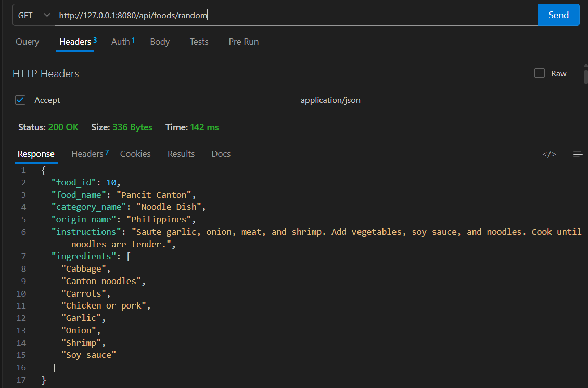

Category foods endpoint test:
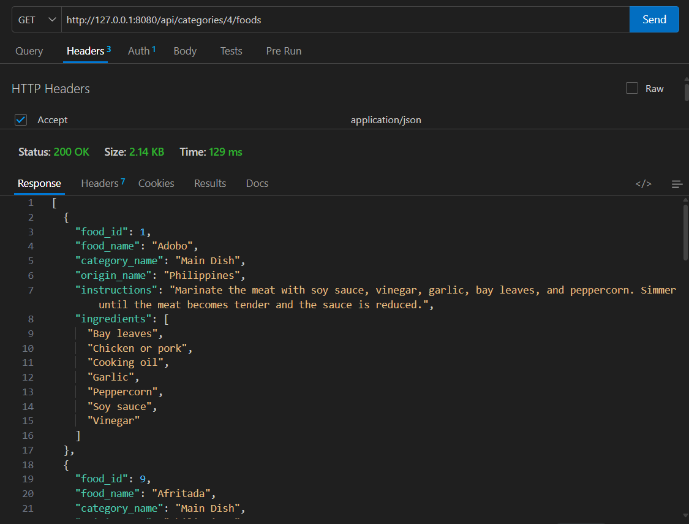

## Repository Contents
The repository contains:
- `public/` — API entry file and route definitions
- `composer.json` — PHP dependency definitions
- `config.example.php` — example configuration file
- `filipino_cookbook_api.sql` — SQL file for database setup
- `README.md` — full installation and API documentation
- `.gitignore` — files excluded from Git tracking
- `Screenshots/` — evidence of successful endpoint testing

## Installation Instructions
Follow these exact steps to install and run the API locally.

### 1. Clone the repository
```bash
git clone https://github.com/Yelsxii/filipino-cookbook-api-gomez.git
cd filipino-cookbook-api-gomez
```

### 2. Install dependencies
If Composer is installed:
```bash
composer install
```
If Composer is not installed, install it first from https://getcomposer.org.

### 3. Create local configuration
Copy the example config file and then open `config.php` in a text editor.

Windows:
```powershell
copy config.example.php config.php
```

Linux / macOS:
```bash
cp config.example.php config.php
```

Update `config.php` with your local database credentials. Example:
```php
return [
    'db_host' => 'localhost',
    'db_name' => 'filipino_cookbook_api_surname',
    'db_user' => 'root',
    'db_pass' => '',
    'api_token' => 'YOUR_API_TOKEN',
];
```


### 4. Create and import the database
Create the database and import the SQL file using either phpMyAdmin or the MySQL command-line client.

#### Option 1: Use phpMyAdmin
- Open phpMyAdmin.
- Create a new database named `filipino_cookbook_api_surname`.
- Select the new database.
- Open the **Import** tab.
- Upload the `filipino_cookbook_api.sql` file from the project folder.
- Run the import.

#### Option 2: Use the MySQL command line
Create the database:
```sql
CREATE DATABASE filipino_cookbook_api_surname;
```
Then run this command from the project folder:
```bash
mysql -u YOUR_DB_USER -p filipino_cookbook_api_surname < filipino_cookbook_api.sql
```

### 5. Start the API server
From the project root directory:
```bash
php -S 127.0.0.1:8080 -t public
```

### 6. Confirm the API is running
Open in a browser or Postman:
- `http://127.0.0.1:8080/` (this will redirect to the welcome endpoint)
- `http://127.0.0.1:8080/api`
You should see a JSON welcome message.

## Database Setup
- Database name: `filipino_cookbook_api_surname`
- SQL file: `filipino_cookbook_api.sql`
- Tables:
  - `categories`
  - `origins`
  - `foods`
  - `ingredients`
  - `food_ingredients`

### Table Relationships
- `categories -> foods <- origins`
- `foods -> food_ingredients <- ingredients`

## Base URL
If you run the PHP built-in server from the project root, the base URL is:
- `http://127.0.0.1:8080/api`

Welcome endpoint:
- `GET http://127.0.0.1:8080/api`

A sample endpoint URL is:
- `http://127.0.0.1:8080/api/foods/random`

If you run the project under a local web server like XAMPP and the repository is placed inside `htdocs`, the base URL can be:
- `http://localhost/filipino-cookbook-api/public/api`

API endpoints begin with `/api`.

## Authentication Instructions
All `/api` requests require a Bearer token header.

Header:
```text
Authorization: Bearer YOUR_API_TOKEN
```

If the token is missing or invalid, the API returns:
- `401 Unauthorized`
- JSON body: `{"status":"error","message":"Unauthorized access. Valid API token is required."}`

## Full Endpoint Documentation
Each endpoint is documented below with exact request details.

---

### GET /api
**Endpoint:**
GET /api

**Description:**
Returns the public welcome message for the API.

**Required headers:**
- No authentication required for this endpoint
- `Accept: application/json`

**Example request:**
http://127.0.0.1:8080/api

Thunder Client / Postman steps:
- Create a new request → Method: `GET` → URL: `http://127.0.0.1:8080/api`
- Click **Send** and inspect the JSON response shown below.

**Example successful response:**
```json
{
  "message": "Welcome to the Secured Filipino Cookbook API",
  "note": "Use a valid Bearer token to access /api endpoints."
}
```

---

### GET /api/foods
**Endpoint:**
GET /api/foods

**Description:**
Returns all foods in the database with category, origin, instructions, and ingredient list.

**Required headers:**
- `Authorization: Bearer YOUR_API_TOKEN`
- `Accept: application/json`

**Example request:**
http://127.0.0.1:8080/api/foods

Thunder Client / Postman steps:
- Create a new request → Method: `GET` → URL: `http://127.0.0.1:8080/api/foods`
- Click **Send** and inspect the JSON response shown below.

**Example successful response:**
```json
[
  {
    "food_id": 11,
    "food_name": "Lumpiang Shanghai",
    "category_name": "Appetizer",
    "origin_name": "Philippines",
    "instructions": "Mix ground pork, vegetables, and egg. Wrap in spring roll wrappers and deep-fry until golden brown.",
    "ingredients": ["Carrots","Egg","Garlic","Ground pork","Onion","Spring roll wrapper"]
  }
]
```

**Example error response:**
```json
{
  "status": "error",
  "message": "Unauthorized access. Valid API token is required."
}
```

Possible errors:
- `401` if token is missing or invalid
- `429` if rate limit is exceeded

---

### GET /api/foods/{id}
**Endpoint:**
GET /api/foods/{id}

**Description:**
Returns the full details for one food item, including ingredient names.

**Path parameter:**
- `id` — numeric food ID

**Required headers:**
- `Authorization: Bearer YOUR_API_TOKEN`
- `Accept: application/json`

**Example request:**
http://127.0.0.1:8080/api/foods/11 (replace `11` with the desired id)

Thunder Client / Postman steps:
- Create a new request → Method: `GET` → URL: `http://127.0.0.1:8080/api/foods/11` (replace `11` with the desired id)
- Click **Send** and inspect the JSON response shown below.

**Example successful response:**
```json
{
  "food_id": 11,
  "food_name": "Lumpiang Shanghai",
  "category_name": "Appetizer",
  "origin_name": "Philippines",
  "instructions": "Mix ground pork, vegetables, and egg. Wrap in spring roll wrappers and deep-fry until golden brown.",
  "ingredients": ["Carrots","Egg","Garlic","Ground pork","Onion","Spring roll wrapper"]
}
```

**Example error response:**
```json
{
  "status": "error",
  "message": "Food not found"
}
```

Error responses:
- `404` if the food ID does not exist
- `401` for missing/invalid token

---

### GET /api/foods/search/{name}
**Endpoint:**
GET /api/foods/search/{name}
**Description:**
Finds foods whose name contains the search term.

**Path parameter:**
- `name` — food search term

**Required headers:**
- `Authorization: Bearer YOUR_API_TOKEN`
- `Accept: application/json`

**Example request:**
http://127.0.0.1:8080/api/foods/search/adobo (replace `adobo` with your search term)

Thunder Client / Postman steps:
- Create a new request → Method: `GET` → URL: `http://127.0.0.1:8080/api/foods/search/adobo` (replace `adobo` with your search term)
- Click **Send** and inspect the JSON response shown below.

**Example successful response:**
```json
[
  {
    "food_id": 12,
    "food_name": "Adobo",
    "category_name": "Main Dish",
    "origin_name": "Philippines",
    "instructions": "Cook pork with soy sauce, vinegar, garlic, and bay leaves.",
    "ingredients": ["Garlic","Bay leaves","Pork","Vinegar","Soy sauce"]
  }
]
```

**Example error response:**
```json
{
  "status": "error",
  "message": "Unauthorized access. Valid API token is required."
}
```

---

### GET /api/categories
**Endpoint:**
GET /api/categories
**Description:**
Returns all food categories.

**Required headers:**
- `Authorization: Bearer YOUR_API_TOKEN`
- `Accept: application/json`

**Example request:**
http://127.0.0.1:8080/api/categories

Thunder Client / Postman steps:
- Create a new request → Method: `GET` → URL: `http://127.0.0.1:8080/api/categories`
- Click **Send** and inspect the JSON response shown below.

**Example successful response:**
```json
[
  {"category_id": 1, "category_name": "Appetizer"},
  {"category_id": 2, "category_name": "Soup"}
]
```

**Example error response:**
```json
{
  "status": "error",
  "message": "Unauthorized access. Valid API token is required."
}
```

---

### GET /api/categories/{id}/foods
**Endpoint:**
GET /api/categories/{id}/foods
**Description:**
Returns foods that belong to the selected category.

**Path parameter:**
- `id` — numeric category ID

**Required headers:**
- `Authorization: Bearer YOUR_API_TOKEN`
- `Accept: application/json`

**Example request:**
http://127.0.0.1:8080/api/categories/1/foods (replace `1` with a valid category id)

Thunder Client / Postman steps:
- Create a new request → Method: `GET` → URL: `http://127.0.0.1:8080/api/categories/1/foods` (replace `1` with a valid category id)
- Click **Send** and inspect the JSON response shown below.

**Example successful response:**
```json
[
  {
    "food_id": 11,
    "food_name": "Lumpiang Shanghai",
    "category_name": "Appetizer",
    "origin_name": "Philippines",
    "instructions": "Mix ground pork, vegetables, and egg. Wrap in spring roll wrappers and deep-fry until golden brown.",
    "ingredients": ["Carrots","Egg","Garlic","Ground pork","Onion","Spring roll wrapper"]
  }
]
```

**Example error response:**
```json
{
  "status": "error",
  "message": "Invalid category_id. Please provide a valid category id."
}
```

Possible errors:
- `400` for invalid category ID
- `404` if the category does not exist

---

### GET /api/foods/random
**Endpoint:**
GET /api/foods/random
**Description:**
Returns one randomly selected food item.

**Required headers:**
- `Authorization: Bearer YOUR_API_TOKEN`
- `Accept: application/json`

**Example request:**
http://127.0.0.1:8080/api/foods/random

Thunder Client / Postman steps:
- Create a new request → Method: `GET` → URL: `http://127.0.0.1:8080/api/foods/random`
- Click **Send** and inspect the JSON response shown below.

**Example successful response:**
```json
{
  "food_id": 14,
  "food_name": "Bulalo",
  "category_name": "Soup",
  "origin_name": "Philippines",
  "instructions": "Boil beef shank and bone marrow until tender. Add corn and vegetables, then simmer before serving.",
  "ingredients": ["Beef shank","Bone marrow","Cabbage","Corn","Onion","Pechay","Peppercorn"]
}
```

**Example error response:**
```json
{
  "status": "error",
  "message": "Unauthorized access. Valid API token is required."
}
```

---

### GET /api/ingredients
**Endpoint:**
GET /api/ingredients
**Description:**
Returns all ingredients in the database.

**Required headers:**
- `Authorization: Bearer YOUR_API_TOKEN`
- `Accept: application/json`

**Example request:**
http://127.0.0.1:8080/api/ingredients

Thunder Client / Postman steps:
- Create a new request → Method: `GET` → URL: `http://127.0.0.1:8080/api/ingredients`
- Click **Send** and inspect the JSON response shown below.

**Example successful response:**
```json
[
  {"ingredient_id": 1, "ingredient_name": "Bay leaves"},
  {"ingredient_id": 2, "ingredient_name": "Carrots"}
]
```

**Example error response:**
```json
{
  "status": "error",
  "message": "Unauthorized access. Valid API token is required."
}
```

---

### POST /api/foods
**Endpoint:**
POST /api/foods
**Description:**
Adds a new food record with category, origin, instructions, and ingredients.

**Required headers:**
- `Authorization: Bearer YOUR_API_TOKEN`
- `Content-Type: application/json`

**Example request:**
http://127.0.0.1:8080/api/foods

Thunder Client / Postman steps:
- Create a new request → Method: `POST` → URL: `http://127.0.0.1:8080/api/foods`
- Body: select raw JSON and paste the payload below, then click **Send**.
  ```json
  {
    "food_name": "New Dish",
    "category_id": 1,
    "origin_id": 1,
    "instructions": "Prepare and cook.",
    "ingredient_ids": [1, 2]
  }
  ```

**Success response:**
```json
{
  "status": "success",
  "message": "Food added successfully."
}
```

**Example error response:**
```json
{
  "status": "error",
  "message": "Invalid or missing input data. Please check all required fields."
}
```

Possible errors:
- `400` if required fields are missing or invalid
- `400` if category or origin does not exist
- `400` if any ingredient IDs are invalid
- `500` on database failure

## HTTP Status Codes
- `200` Request completed successfully
- `201` Resource created successfully
- `400` Invalid request or parameter
- `401` Missing or invalid authentication
- `404` Resource not found
- `429` Too many requests
- `500` Internal server error

## Testing Instructions
These are the exact steps another student should follow to verify the API.

1. Start the local server:
   ```bash
   php -S 127.0.0.1:8080 -t public
   ```

2. Open Postman, Thunder Client, or use `curl` from a terminal.
3. Create a new request and configure it precisely:
   - **Method:** Choose the correct HTTP method for the endpoint.
     - `GET` for read-only endpoints
     - `POST` only for creating a new food record
   - **URL:** Paste the full endpoint URL exactly.
     - Example GET URLs:
       - `http://127.0.0.1:8080/api/foods`
       - `http://127.0.0.1:8080/api/foods/11`
       - `http://127.0.0.1:8080/api/foods/random`
     - Example POST URL:
       - `http://127.0.0.1:8080/api/foods`
   - **Headers:** Add the required headers for every request:
     - `Authorization: Bearer YOUR_API_TOKEN`
     - `Accept: application/json`
     - For `POST` requests only: `Content-Type: application/json`
   - **Body (POST only):** If the endpoint is `POST /api/foods`, switch to raw JSON and paste a valid payload.
     ```json
     {
       "food_name": "New Dish",
       "category_id": 1,
       "origin_id": 1,
       "instructions": "Prepare and cook.",
       "ingredient_ids": [1, 2]
     }
     ```
   - **Send:** Click `Send` or execute the equivalent `curl` command.
   - **Verify the response:**
     - Status code should be `200` or `201` for success.
     - Response header should include `Content-Type: application/json`.
     - JSON body should match the expected success or error structure described in the endpoint documentation.

### Test cases to run
- `GET http://127.0.0.1:8080/api`
- `GET http://127.0.0.1:8080/api/foods`
- `GET http://127.0.0.1:8080/api/foods/11`
- `GET http://127.0.0.1:8080/api/foods/random`
- `GET http://127.0.0.1:8080/api/foods/search/lumpia`
- `GET http://127.0.0.1:8080/api/categories`
- `GET http://127.0.0.1:8080/api/categories/1/foods`
- `GET http://127.0.0.1:8080/api/ingredients`
- `POST http://127.0.0.1:8080/api/foods` with a valid JSON body
- `GET http://127.0.0.1:8080/api/foods` without the Authorization header to confirm `401`

### What to change in the local setup
Open `config.php` and update:
- `db_host`
- `db_name`
- `db_user`
- `db_pass`
- `api_token`

Use your own MySQL credentials and the same token value in requests.


Quick reminder: copy `config.example.php` to `config.php` before running the server:

Windows:
```powershell
copy config.example.php config.php
```

Linux / macOS:
```bash
cp config.example.php config.php
```

## Testing Evidence

This section contains the required evidence that the API endpoints, authentication, validation, error handling, and optional enhancements were tested successfully.


### Successful Endpoint Tests

#### 1. API Welcome Endpoint

- **Method:** `GET`
- **URL:** `http://127.0.0.1:8080/api`
- **Expected status:** `200 OK`
- **Description:** Confirms that the API server is running and returns the Filipino Cookbook API welcome response.

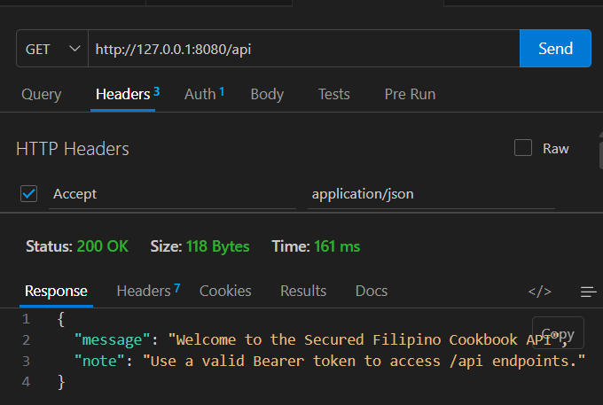

#### 2. Retrieve All Foods

- **Method:** `GET`
- **URL:** `http://127.0.0.1:8080/api/foods`
- **Expected status:** `200 OK`
- **Screenshot filename:** `Screenshots/Foods.png`
- **Evidence description:** Confirms that the API returns the complete food collection with category, origin, instructions, and ingredient data.

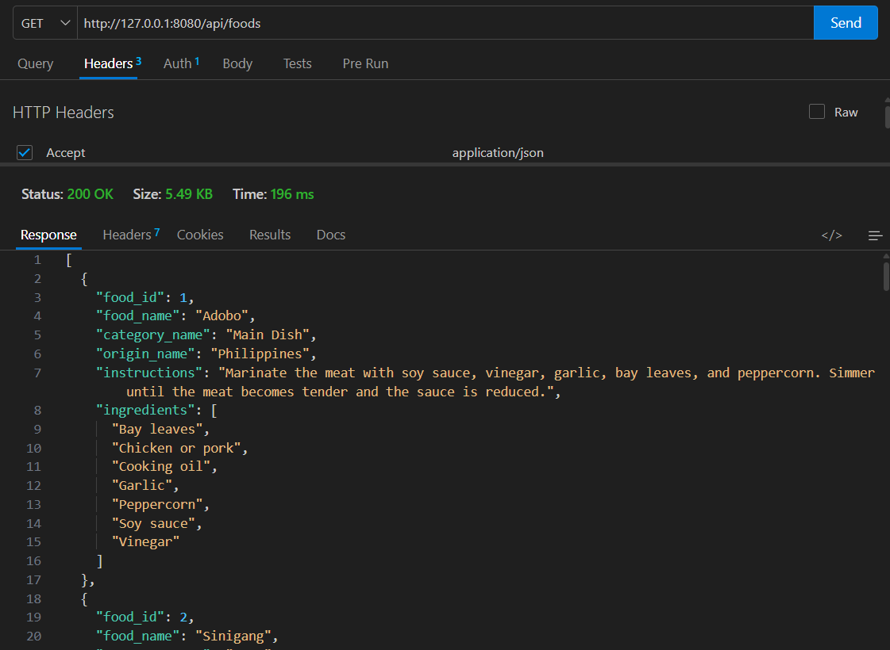

#### 3. Retrieve One Food by ID

- **Method:** `GET`
- **URL:** `http://127.0.0.1:8080/api/foods/1`
- **Expected status:** `200 OK`
- **Screenshot filename:** `Screenshots/FoodDetails.png`
- **Evidence description:** Confirms that a valid food ID returns the full details and ingredient list of one food record.

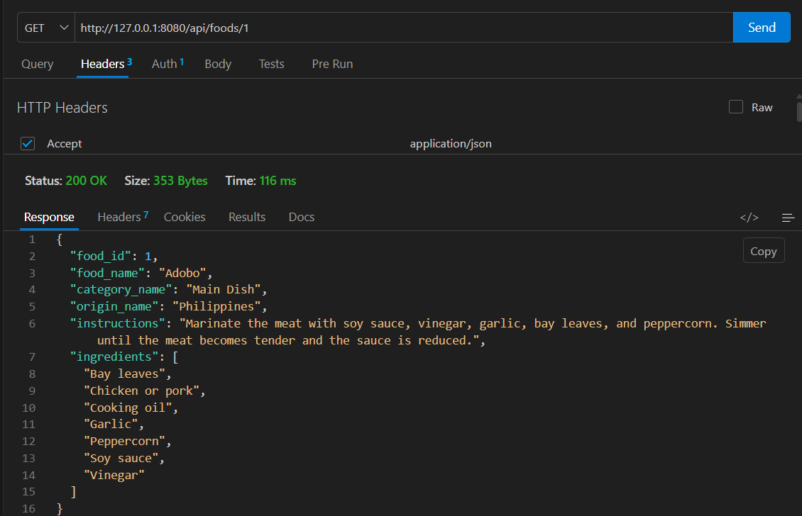

#### 4. Search Foods by Name

- **Method:** `GET`
- **URL:** `http://127.0.0.1:8080/api/foods/search/adobo`
- **Expected status:** `200 OK`
- **Screenshot filename:** `Screenshots/FoodSearch.png`
- **Evidence description:** Confirms that the case-insensitive food search endpoint returns records whose names match the supplied search term.

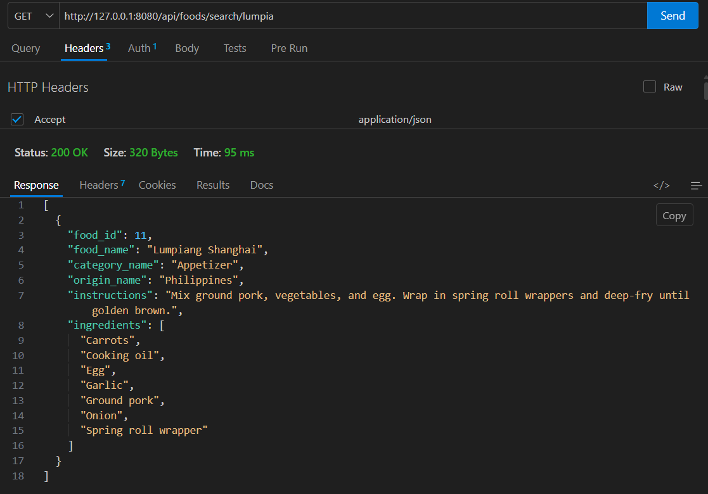

#### 5. Retrieve All Categories

- **Method:** `GET`
- **URL:** `http://127.0.0.1:8080/api/categories`
- **Expected status:** `200 OK`
- **Screenshot filename:** `Screenshots/Categories.png`
- **Evidence description:** Confirms that the API returns all available Filipino food categories.

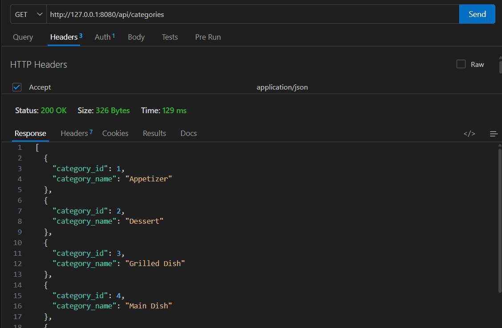

#### 6. Retrieve All Ingredients

- **Method:** `GET`
- **URL:** `http://127.0.0.1:8080/api/ingredients`
- **Expected status:** `200 OK`
- **Screenshot filename:** `Screenshots/Ingredients.png`
- **Evidence description:** Confirms that the API returns the complete ingredient list.

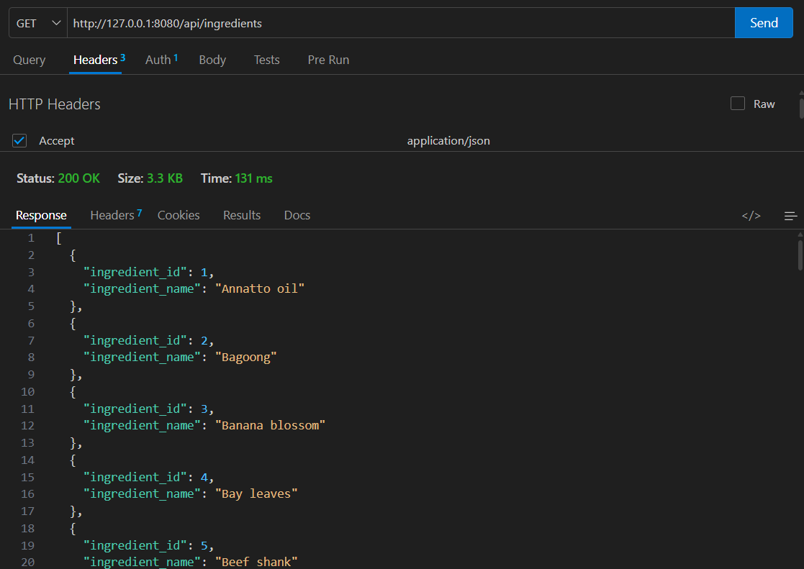

#### 7. Add a New Food

- **Method:** `POST`
- **URL:** `http://127.0.0.1:8080/api/foods`
- **Expected status:** `201 Created`
- **Screenshot filename:** `Screenshots/AddFood.png`
- **Evidence description:** Confirms that a valid JSON request creates a new food record and its ingredient relationships.

Use this sample raw JSON body:

```json
{
  "food_name": "Thunder Client Test Dish",
  "category_id": 4,
  "origin_id": 4,
  "instructions": "Prepare the ingredients and cook until done.",
  "ingredient_ids": [18, 26, 40]
}
```

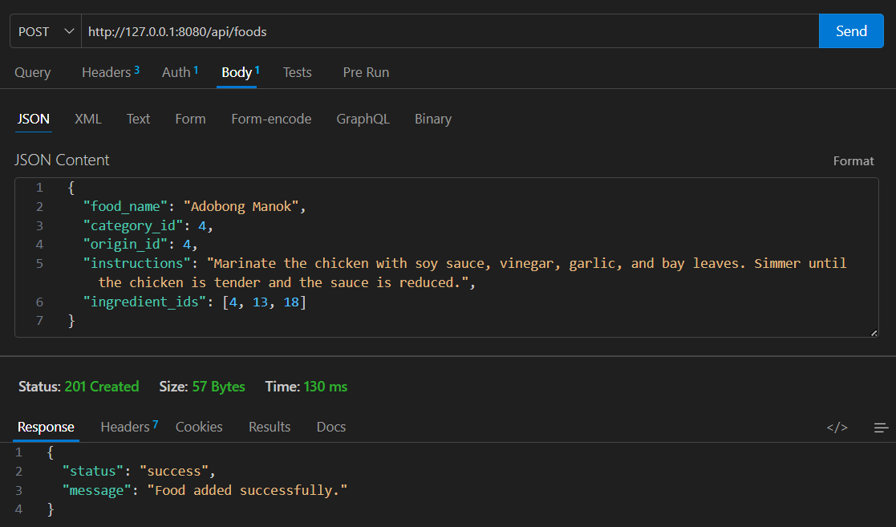

---

### Optional Enhancement Tests

#### 8. Retrieve a Random Food

- **Enhancement:** New endpoint
- **Method:** `GET`
- **URL:** `http://127.0.0.1:8080/api/foods/random`
- **Expected status:** `200 OK`
- **Screenshot filename:** `Screenshots/Random.png`
- **Evidence description:** Confirms that the optional random-food endpoint returns one complete food record selected from the database.


#### 9. Retrieve Foods by Category

- **Enhancement:** New endpoint
- **Method:** `GET`
- **URL:** `http://127.0.0.1:8080/api/categories/1/foods`
- **Expected status:** `200 OK`
- **Screenshot filename:** `Screenshots/Category.png`
- **Evidence description:** Confirms that the optional category-food endpoint returns only the foods assigned to the selected category.


#### 10. Basic Rate-Limit Test

- **Enhancement:** Security improvement
- **Endpoint used:** `GET /api/foods`
- **Configured limit:** More than 60 requests from the same client within 60 seconds
- **Expected status after exceeding the limit:** `429 Too Many Requests`
- **Screenshot filename:** `Screenshots/RateLimit429.png`
- **Evidence description:** The completed screenshot must show that excessive requests are blocked and a JSON error response is returned.

For a reliable rapid-request test in Windows PowerShell, replace `YOUR_API_TOKEN` with the token configured in `config.php`, then run:

```powershell
$headers = @{
    Authorization = "Bearer YOUR_API_TOKEN"
    Accept = "application/json"
}

1..65 | ForEach-Object {
    try {
        $response = Invoke-WebRequest `
            -Uri "http://127.0.0.1:8080/api/foods" `
            -Headers $headers `
            -UseBasicParsing

        Write-Host "Request $_ : $($response.StatusCode)"
    }
    catch {
        $statusCode = $_.Exception.Response.StatusCode.value__
        Write-Host "Request $_ : $statusCode"
    }
}
```

After the command returns `429`, immediately send one more `GET /api/foods` request in Thunder Client and capture the visible `429` status and JSON response. Use only an actual response from the running API; do not create or edit the evidence manually.

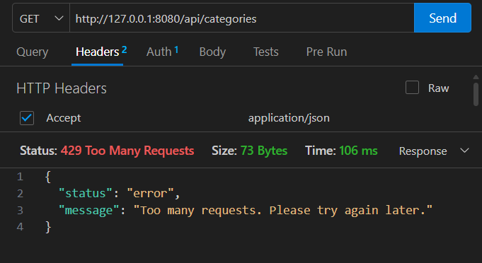

---

### Common Error Response Tests

These screenshots demonstrate that the API returns understandable JSON errors and appropriate HTTP status codes.

#### 1. Missing or Invalid Bearer Token

- **Method:** `GET`
- **URL:** `http://127.0.0.1:8080/api/foods`
- **How to reproduce:** Remove the `Authorization` header or use an incorrect token.
- **Expected status:** `401 Unauthorized`
- **Screenshot filename:** `Screenshots/Error401.png`
- **Evidence description:** Confirms that protected endpoints reject requests that do not contain the correct Bearer token.

Expected response:

```json
{
  "status": "error",
  "message": "Unauthorized access. Valid API token is required."
}
```

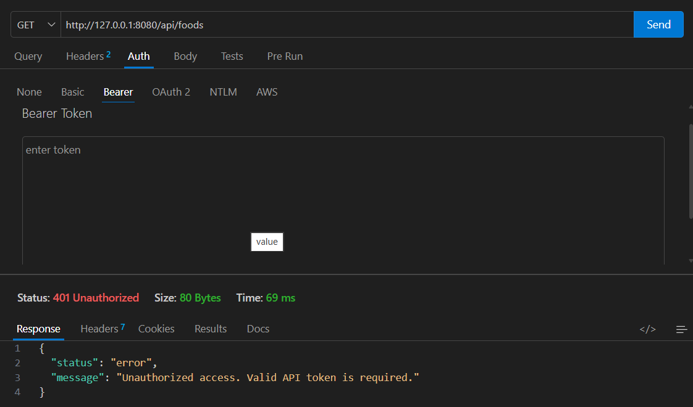

#### 2. Food Record Not Found

- **Method:** `GET`
- **URL:** `http://127.0.0.1:8080/api/foods/99999`
- **How to reproduce:** Use a food ID that does not exist while keeping the valid Authorization header.
- **Expected status:** `404 Not Found`
- **Screenshot filename:** `Screenshots/Error404.png`
- **Evidence description:** Confirms that the API returns a clear not-found response for a missing food record.

Expected response:

```json
{
  "status": "error",
  "message": "Food not found"
}
```

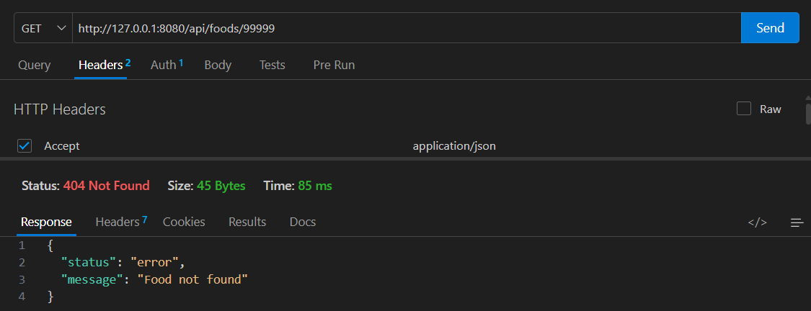

#### 3. Invalid or Incomplete Food Data

- **Method:** `POST`
- **URL:** `http://127.0.0.1:8080/api/foods`
- **How to reproduce:** Send an incomplete request body, such as the example below with no `ingredient_ids`.
- **Expected status:** `400 Bad Request`
- **Screenshot filename:** `Screenshots/Error400.png`
- **Evidence description:** Confirms that the API validates required input before inserting a food record.

Use this invalid raw JSON body:

```json
{
  "food_name": "Incomplete Test Dish",
  "category_id": 4,
  "origin_id": 4,
  "instructions": "This request intentionally has no ingredient IDs."
}
```

Expected response:

```json
{
  "status": "error",
  "message": "Please provide food_name, category_id, origin_id, instructions, and ingredient_ids."
}
```

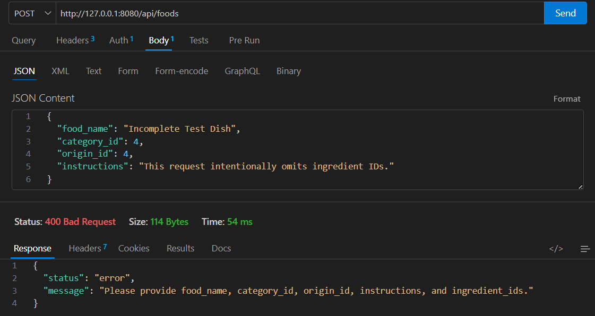

### Evidence Summary

The screenshots above provide evidence for:

- Successful testing of every available API endpoint
- Successful testing of the two optional endpoint enhancements
- Bearer token authentication
- Input validation and not-found handling
- JSON response formatting
- Successful resource creation
- The rate-limit test procedure and its required `429` evidence


## Developer Information
- Student Name: Lizhary Ylexis Gomez
 - Course and Section: Information Technology - 4B
- GitHub Username: Yelsxii
- Repository Link: https://github.com/Yelsxii/filipino-cookbook-api-gomez.git
- Date Completed: 2026-07-22
